# Xilinx FPGA Tutorial

```
Author : 
    Jyun-Liang, Chen
    Pin-Lun, Lin
```

## 1. Outline
- [Xilinx FPGA Tutorial](#xilinx-fpga-tutorial)
  - [1. Outline](#1-outline)
  - [2. Introduction](#2-introduction)
  - [3. Vivado](#3-vivado)
      - [3.1 Requirement](#31-requirement)
      - [3.2 Create IP Package](#32-create-ip-package)
      - [3.3 Create Block Diagrame](#33-create-block-diagrame)
  - [4. SDK](#4-sdk)
      - [4.1 Create Project](#41-create-project)
      - [4.2 Standalone Driver](#42-standalone-driver)
  - [5. Petalinux](#5-petalinux)
      - [5.1 Create Project](#51-create-project)
      - [5.2 Device Tree](#52-device-tree)
      - [5.3 Linux Driver](#53-linux-driver)
      - [5.4 Linux Application](#54-linux-application)
  - [6 Linux File System](#6-linux-file-system)
      - [6.1 Petalinux設定](#61-petalinux%e8%a8%ad%e5%ae%9a)
      - [6.2 Ubuntu(For ARM-64bit)](#62-ubuntufor-arm-64bit)
      - [6.3 Arch Linux(For Zedboard)](#63-arch-linuxfor-zedboard)

## 2. Introduction

**TODO**

------

## 3. Vivado

#### 3.1 Requirement

- Install vivado
- Create a vivado project.
- Import your RTL design.
- Check your design don't have bug.

In this tutorial, I use：

- Xilinx Vivado 2018.3
- Petalinux 2018.3
- CentOS 7 on Server
- Ubuntu 18.04 Arm 64bits Server Edition on FPGA
- ZCU102

Following is the RTL sample in this tutorial：

```Verilog
module calculator #(
    parameter DATA_BW = 16
) (
    input                       clk,
    input                       rst,
    input      [DATA_BW-1:0]    din0,
    input      [DATA_BW-1:0]    din1,
    output reg [DATA_BW:0]      sum,
    output reg [DATA_BW*2-1:0]  product
);
    always@(posedge clk) begin
        if(rst) begin
            sum     <= {(DATA_BW+1){1'b0}};
            product <= {(DATA_BW*2){1'b0}};
        end else begin
            sum     <= din0 + din1;
            product <= din0 * din1;
        end
    end
endmodule
```

#### 3.2 Create IP Package

首先建立Vivado專案並匯入前述的RTL程式碼，接著開始將硬體封裝成IP。

>File &rarr; Create and Package New IP... &rarr; Next

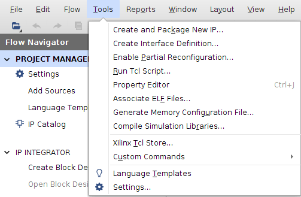

>Create a new AXI4 peripheral &rarr; Next

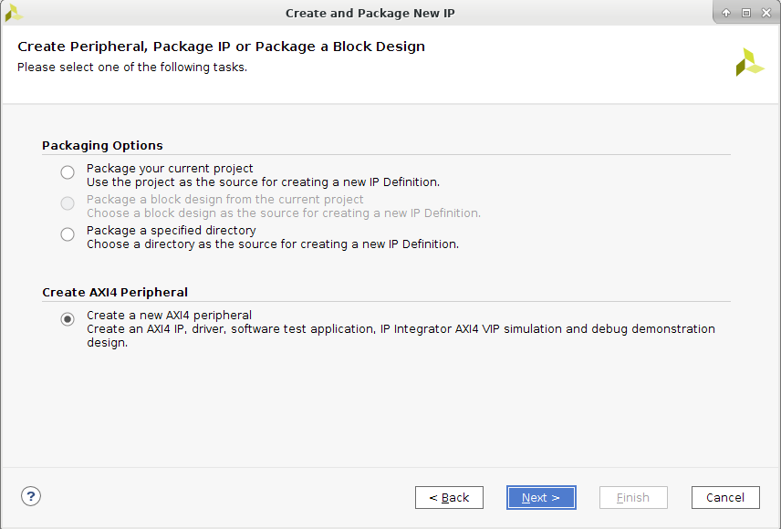

>定義IP名字和路徑 &rarr; Next

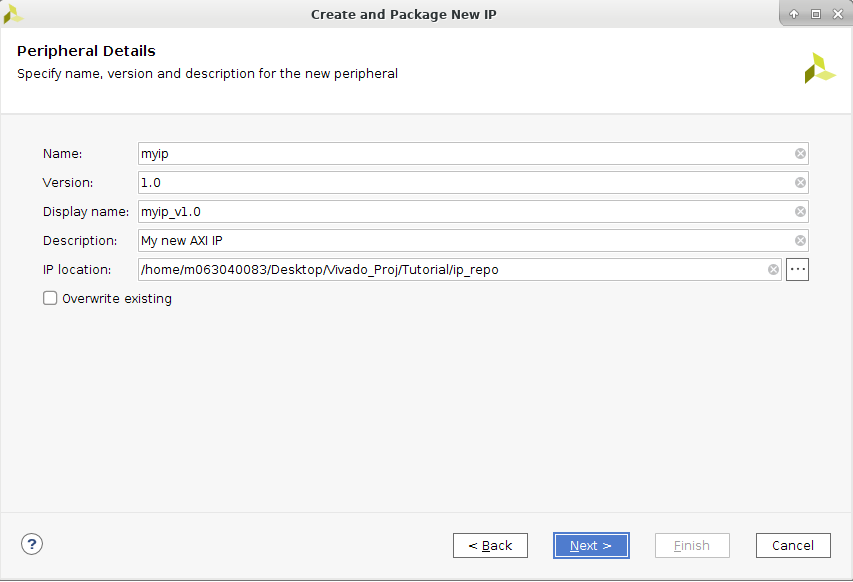

>此處先選擇AXI-Lite Slave的Wrapper當作入門，Number of Registers根據硬體有多少IO Ports決定 (clk、rst除外)

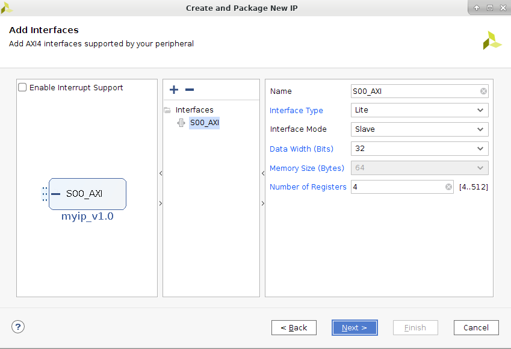

>Edit IP &rarr; Finish

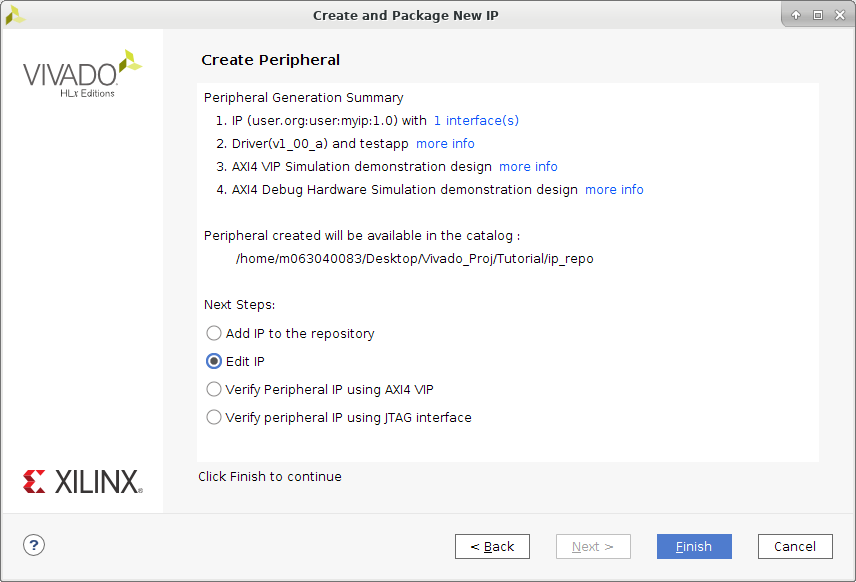

完成後會跳出新專案的視窗，需重新加入原本的RTL檔案，變成下列的檔案階層\

```plaintext
├──myip_v1_0.v
|  ├──myip_v1_0_S00_AXI.v
|  |  └──tutorial.v
|  └──
└──
```

匯入檔案後須修改Wrapper內的程式碼

>於myip_v1_0_S00_AXI.v的開頭宣告parameter

```Verilog
6   // Users to add parameters here
7   parameter DATA_BW = 16, 
8   // User parameters ends
9   // Do not modify the parameters beyond this line
```

>宣告輸出的Wire並連接到下列多工器

```Verilog
365 // Implement memory mapped register select and read logic generation
366 // Slave register read enable is asserted when valid address is available
367 // and the slave is ready to accept the read address.
368 wire [DATA_BW:0]     sum;
369 wire [DATA_BW*2-1:0] product;
370
371 assign slv_reg_rden = axi_arready & S_AXI_ARVALID & ~axi_rvalid;
372
373 always @(*)
374 begin
375     // Address decoding for reading registers
376     case ( axi_araddr[ADDR_LSB+OPT_MEM_ADDR_BITS:ADDR_LSB] )
377         2'h0    : reg_data_out <= slv_reg0;
378         2'h1    : reg_data_out <= slv_reg1;
379         2'h2    : reg_data_out <= sum;
380         2'h3    : reg_data_out <= product;
381         default : reg_data_out <= 0;
382     endcase
383 end
```

>呼叫先前的Module並接線

```Verilog
404 // Add user logic here
405 calculator #(
406     .DATA_BW (DATA_BW)
407 ) u_calculator (
408     .clk    (S_AXI_ACLK),
409     .rst    (!S_AXI_ARESETN),
410     .din0   (slv_reg0),
411     .din1   (slv_reg1),
412     .sum    (sum),
413     .product(product)
414 );
415 // User logic ends
```

>myip_v1_0_S00_AXI.v修改後接著修改myip_v1_0.v

>宣告Parameter

```Verilog
6   // Users to add parameters here
7   parameter DATA_BW = 16,
8   // User parameters ends
9   // Do not modify the parameters beyond this

......

47  myip_v1_0_S00_AXI # (
48     .DATA_BW (DATA_BW),
49     .C_S_AXI_DATA_WIDTH(C_S00_AXI_DATA_WIDTH),
50     .C_S_AXI_ADDR_WIDTH(C_S00_AXI_ADDR_WIDTH)
```

Wrapper的簡易架構圖如下 :

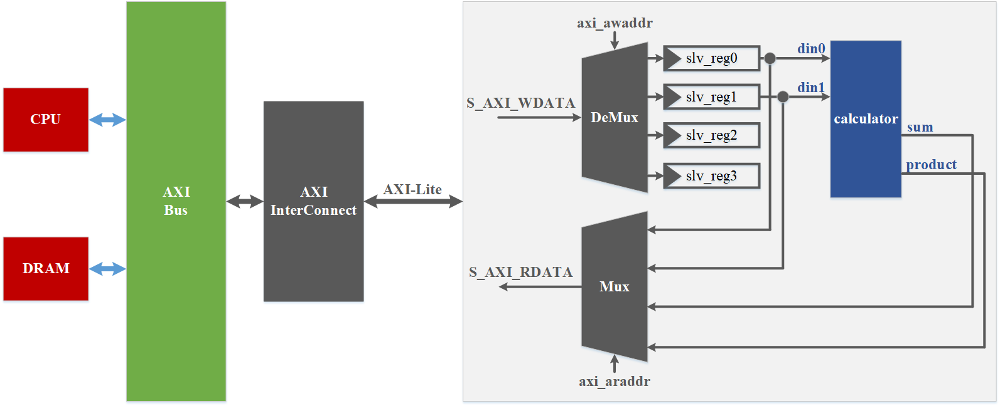

修改後打開component.xml

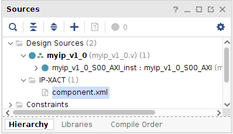

>不是綠勾的項目先點進去後 &rarr; Merge changes from XXX Wizard

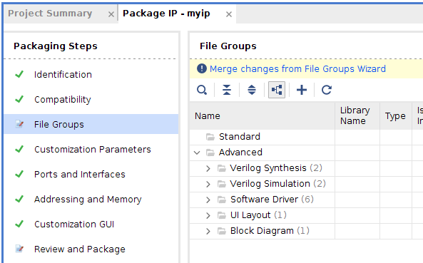

------

**以下共有4個Case分別解釋，若沒有遇到以下的Case可跳過**

**Case 1**

若IP有複數個AXI協定，並且要共用同一個Clock Source
>Ports and Interface &rarr; 右鍵欲共用Clock的**所有**AXI協定 &rarr; Associate Clocks... &rarr; 勾選該Clock Source


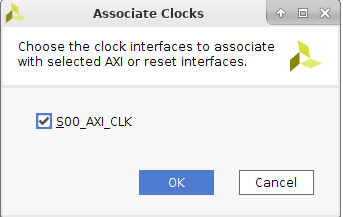

**Case 2**

若Wrapper是自己寫的，需要自己手動生成匯流排的介面

>Ports and Interface &rarr; Add Bus Interface...

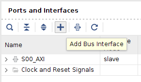

>填入介面的名字 &rarr; 選擇匯流排的模式

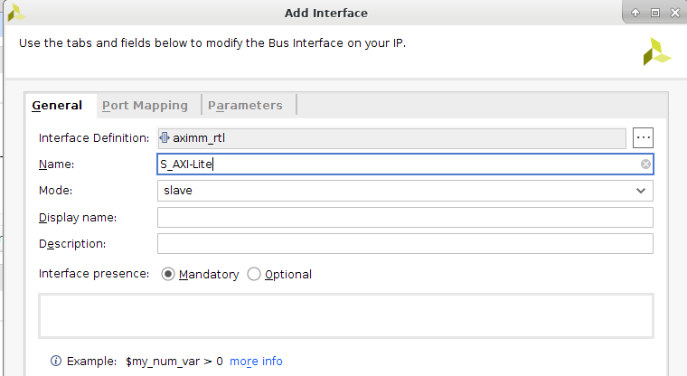

>切換到Port Mapping頁面將左右兩欄相同的Port選取後 &rarr; Map Ports &rarr; 全部的Port都Map完後按OK

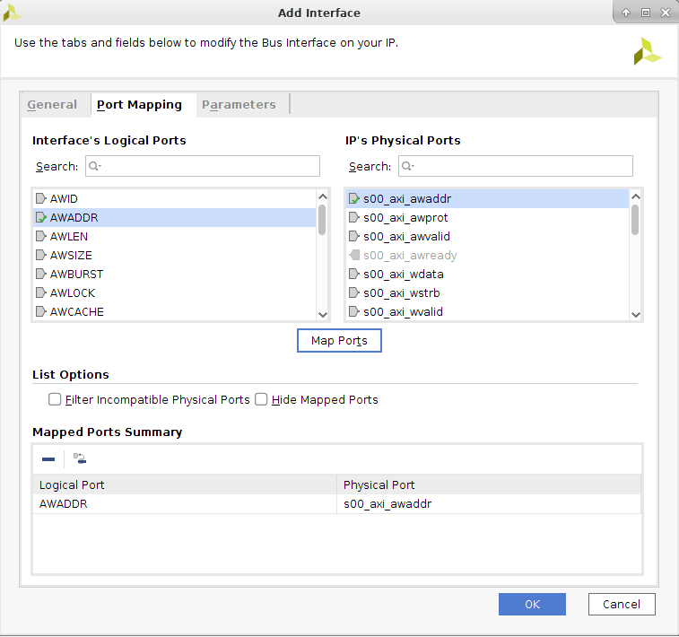

**Case 3**

若有Interrupt訊號，需要自己手動設定格式

>Ports and Interface &rarr; Add Bus Interface... (圖同Case2)

>選擇介面的定義 &rarr; 填入介面的名字 &rarr; 選擇匯流排的格式(通常為Master)

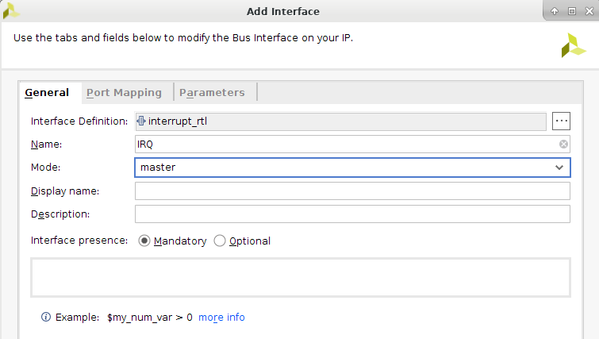

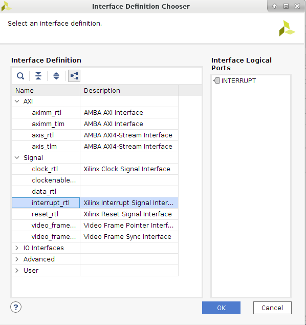

>切換到Port Mapping頁面將左右兩欄相同的Port選取後 &rarr; Map Ports &rarr; 全部的Port都Map完後按OK

**Case 4**

若有RTL程式碼內有Parameter希望能夠從IP的GUI設定

>Customization GUI &rarr; 將Hidden Parameters移動到Window的欄位下
>(也可以先Add Page / Group後移動到Page / Group下)

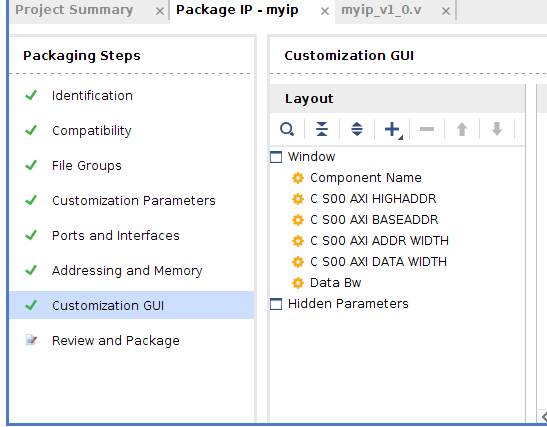

******

IP全部設定完成後
>Review and Package &rarr; Re-package IP &rarr; 若還會修改IP則選No

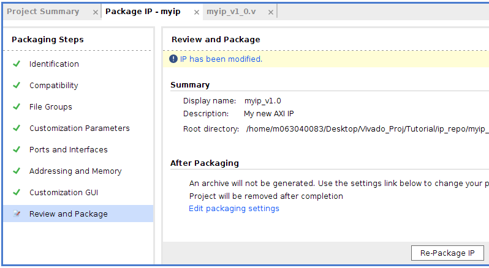


#### 3.3 Create Block Diagrame

首先須建立一個新專案，

接著建立Block Design
>Create Block Design &rarr; OK

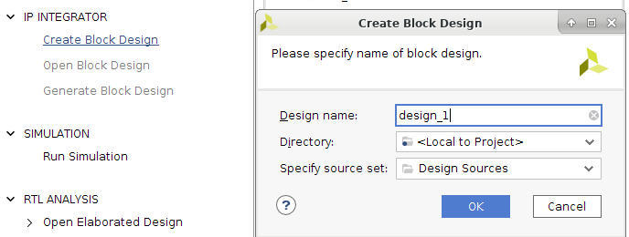

將2.2節封裝好的IP加入專案
>Settings &rarr; IP &rarr; Repository &rarr; Add &rarr; (Path of IP) &rarr; OK &rarr; OK

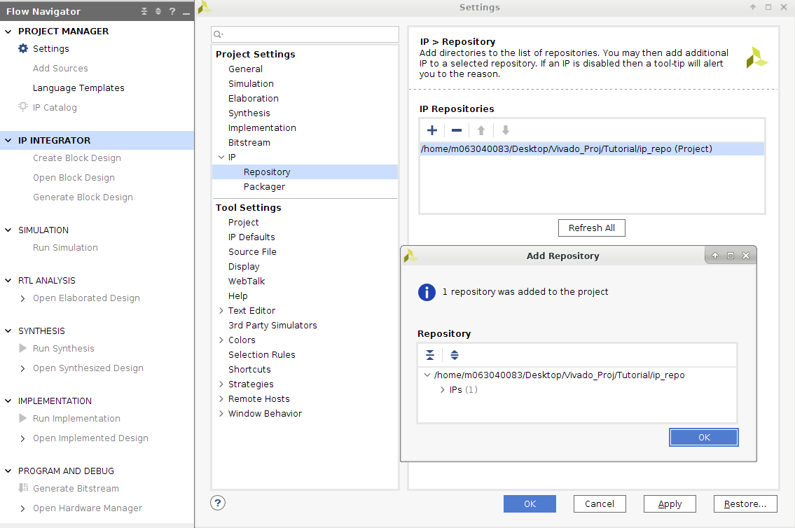

在Block Diagrame內呼叫IP以及PS端的IP

>Diagrame &rarr; Add IP &rarr; Zynq UltraScale+ MPSoC

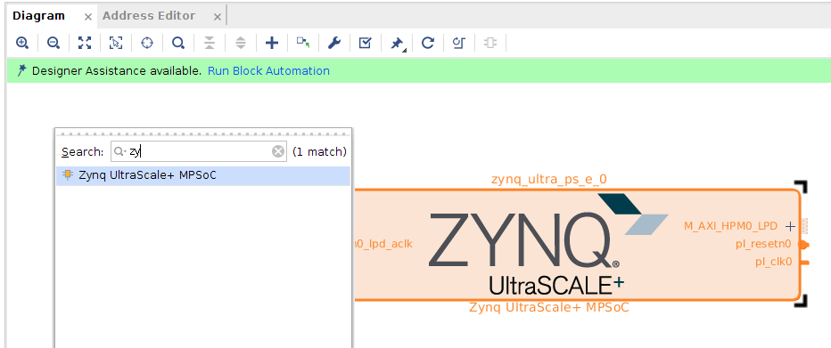

>Diagrame &rarr; Add IP &rarr; myip_v1.0

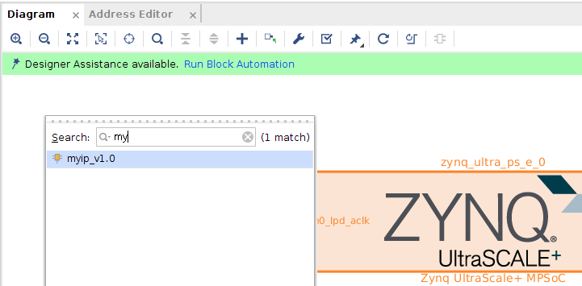

自動設定ZynqMP的IP

>Run Block Automation &rarr; OK

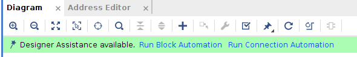

根據需求調整ZynqMP的Port數以及Bandwidth

>左鍵雙擊IP &rarr; PS-PL Configuration &rarr; PS-PL Interfate

**Note : 各個Port的介紹**

| Port        |                      用途                       |
| :---------- | :---------------------------------------------: |
| AXI_HPM_FPD |                高速的Master Port                |
| AXI_HPM_LPD |                低速的Master Port                |
| AXI_HPC_FPD |  高速且可以支援硬體Cache Coherent的Slave Port   |
| AXI_HP_FPD  |                高速的Slave Port                 |
| AXI_LPD     |                低速的Slave Port                 |
| S_AXI_ACP   | 可以支援硬體Cache Coherent的Slave Port (不確定) |
| S_AXI_ACE   |                     不清楚                      |

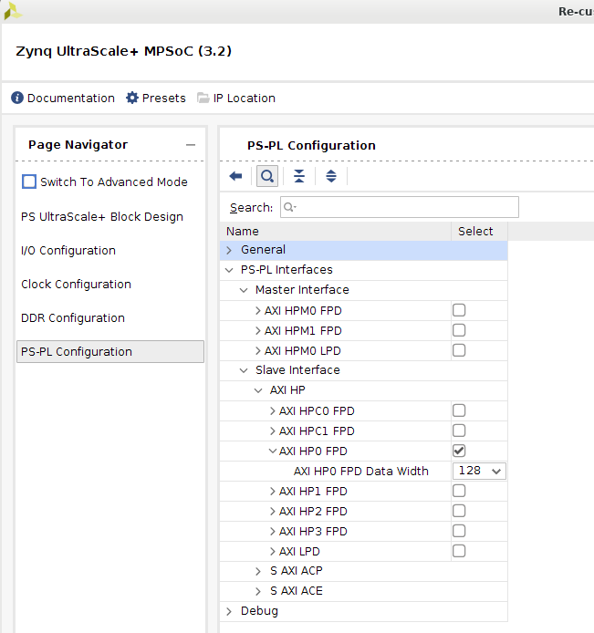

若有IP有Interrupt的需求

>左鍵雙擊IP &rarr; PS-PL Configuration &rarr; General &rarr; Interrupts &rarr; PL to PS

**Note : IRQ0和IRQ1各7bits可以支援共14條IRQ訊號，但必須用Concate IP將7條以內的IRQ合併成一條後接到Zynq的IP上**

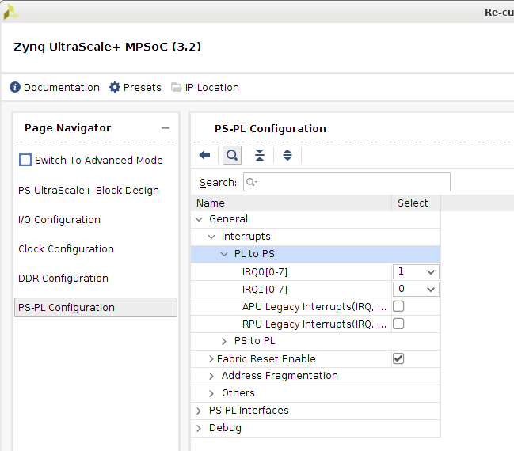

調整時脈

>左鍵雙擊IP &rarr; Clock Configuration &rarr; Output Clocks &rarr; Low Power Domain Clocks &rarr; PL Fabric Clocks &rarr; 根據需求勾選要幾個Clock Source &rarr; 設定Requested Freq (MHz) &rarr; OK

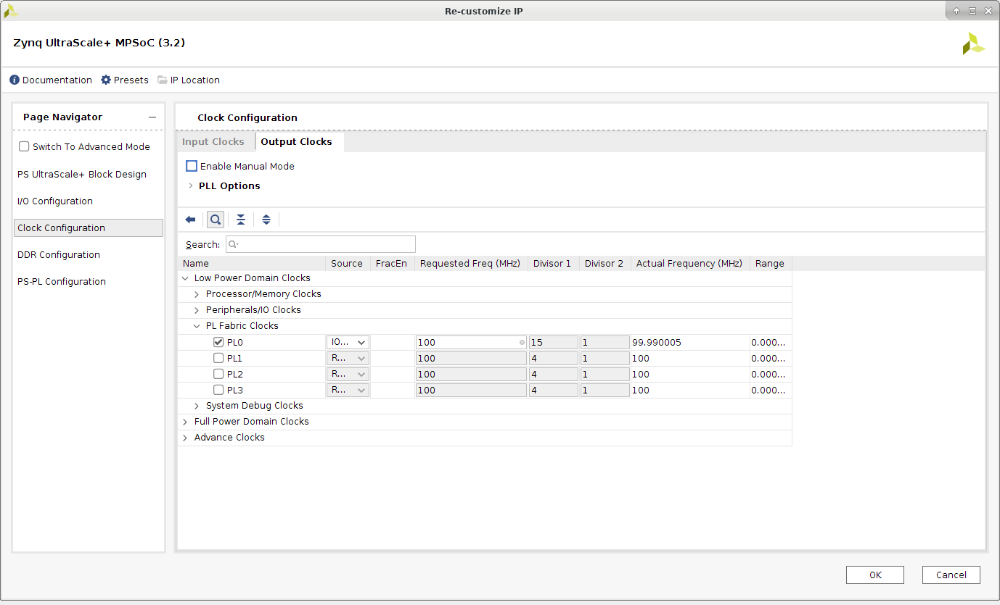

ZynqMP的IP設定完後，將ZynqMP和my_IP的Port相接

>Run Connection Automation (有時候會接錯，要手動調整)

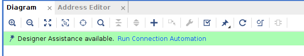

接完後如下

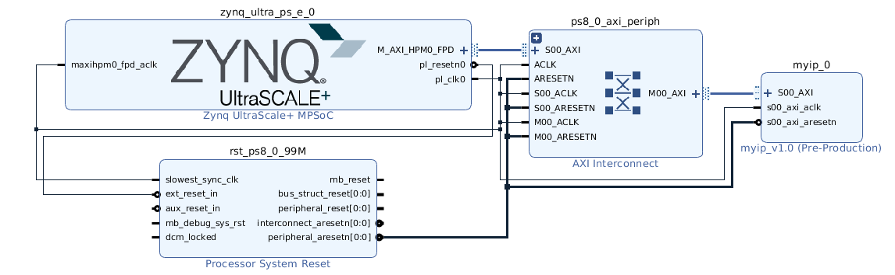

在所有線接完後可以按Regenerate Layout重新排列IP


檢查Address Editor內有賦予IP地址，若有需求，地址可手動修改；**另外地址會於SDK或是Device Tree用到**

**Note : Default Offset Address每個FPGA不一定相同**
  - ZedBoard從0x43C00000開始
  - ZCU102從0xA0000000開始

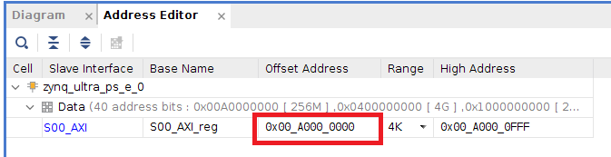

接著按Validate Design確認沒有Error或Critical Warning並盡量將Warning修正掉


Block Diagrame驗證完成後，需要建立由RTL編寫的Top Module

>右鍵Block Diagrame的.db檔 &rarr; Create HDL Wrapper... &rarr; Let Vivado manage wrapper and auto-update &rarr; OK

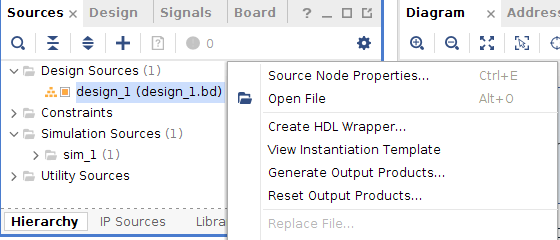


最後按Generate Bitstream做Synthesis and Implementation

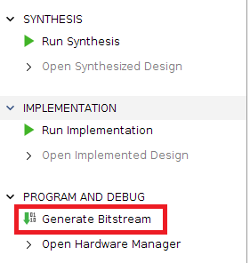

**合成完成後確認沒有Error，Critical Warning和Warning需檢查是否會影響電路功能**

------

**Special Case :** 若Block Diagrame完成後，又重新修改IP，則Block Diagrame會出現Refresh IP Catalog

>Refresh IP Catalog 

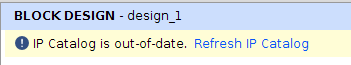

按下Refresh IP Catalog後下方會出現IP Status的小視窗

>Upgrade Select &rarr; OK

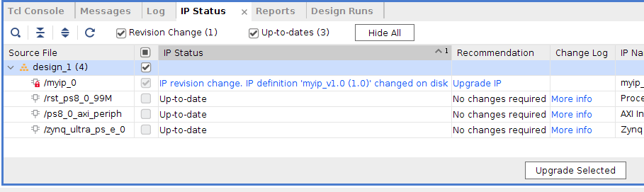

>Out of Context Per IP &rarr; Generate &rarr; OK

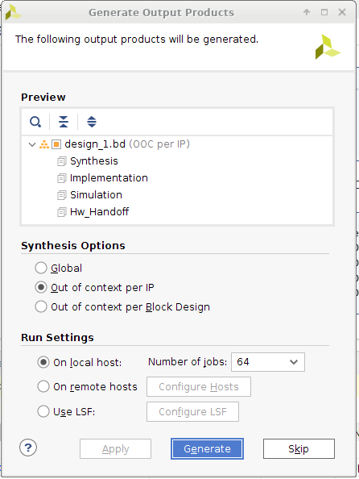

**Note : 有時候Refresh IP Catalog會失敗，需自行檢查，若失敗建議將.bd檔刪除並重新建立Block Diagrame，或是整個專案刪除重建**

------

## 4. SDK

#### 4.1 Create Project

確認 **Generate Bitstream** 完成

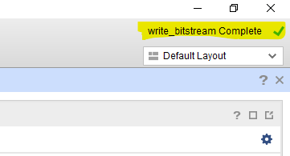

之後將 **Bitstream** 匯入至 **SDK**

> File &rarr; Export &rarr; Export Hardware...

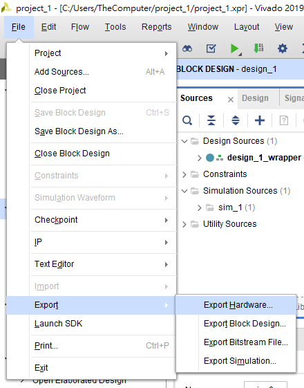


開啟**SDK**

> File &rarr; Launch SDK

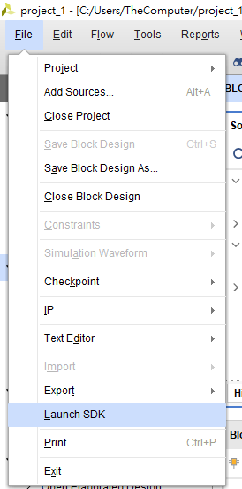

**SDK**

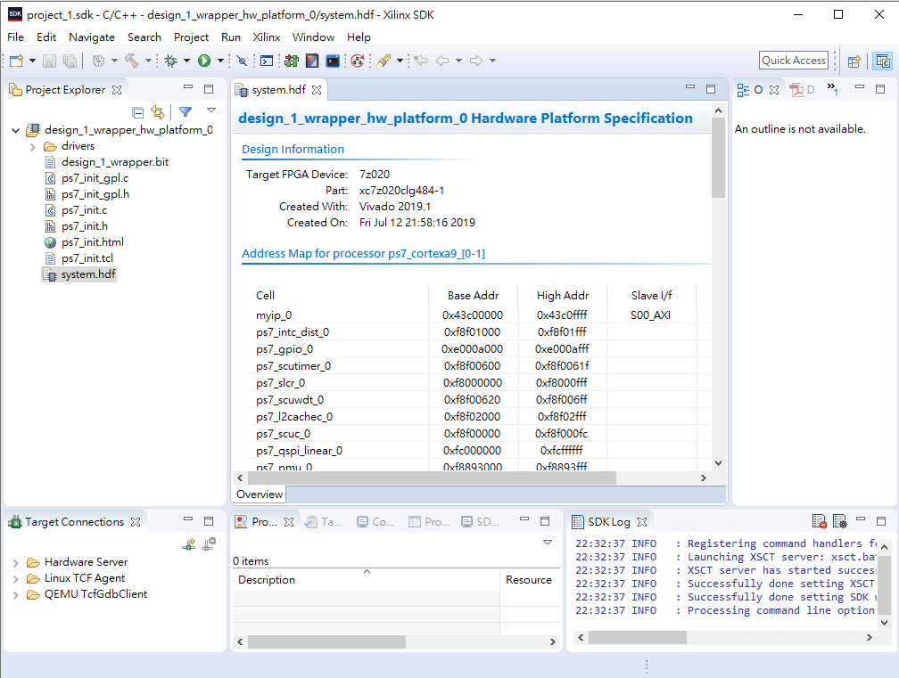

建立專案

> File &rarr; New &rarr; Application Project

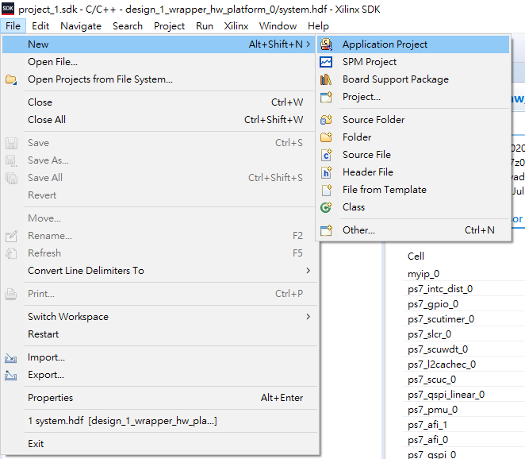

設定Project Name

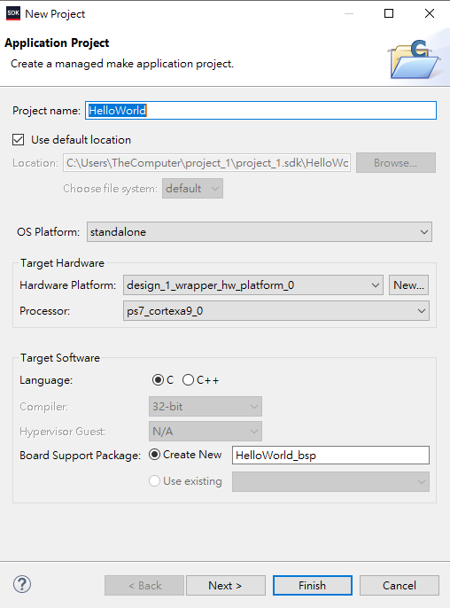

選擇空專案的模版

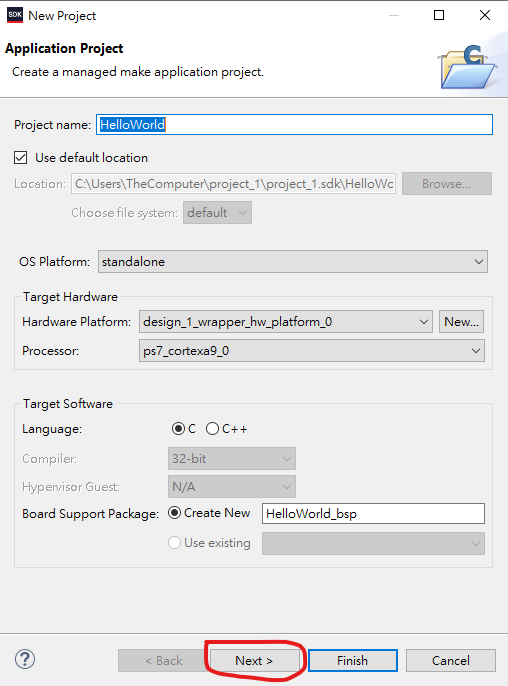

將2條 _Micro-USB to USB_ 的線分別插入 _USB Uart_ 以及 _USB JTAG_

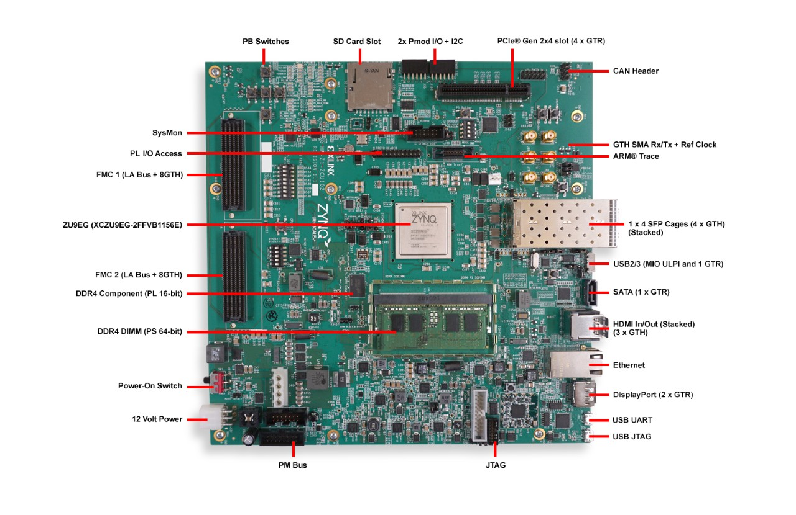

將 **Bitstream** 檔燒入至 **Zedboard**

> Xilinx &rarr; Program FPGA

or

> Click Toolbar
> 


之後會跳出一個視窗，確認**Bitstream**無誤之後就可以按下**Program**

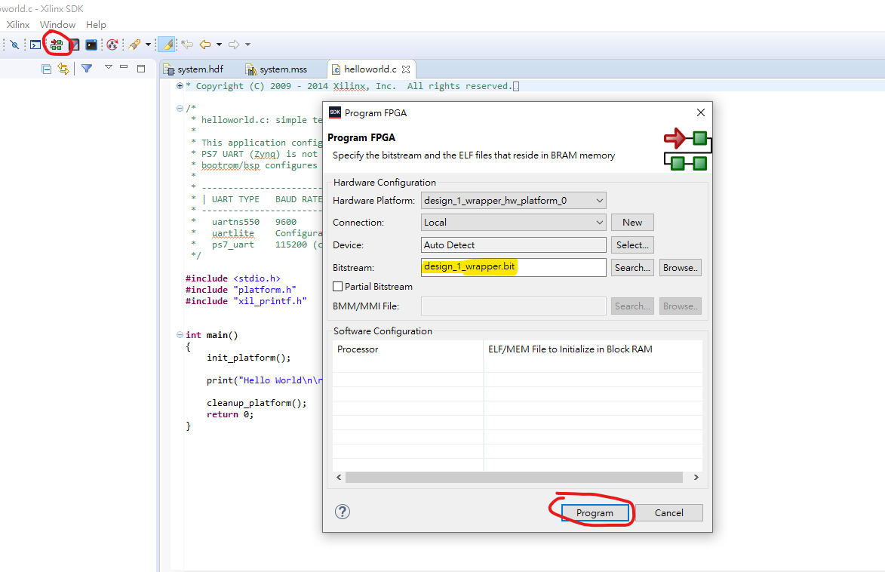

按下**Program**之後，會跳出一個視窗等到他跑完為止。


燒入成功之後，**Zedboard**會亮藍燈。


開啟**SDK Terminal**


若找不到可以從這邊開啟

> Window &rarr; Show View  &rarr; Other...

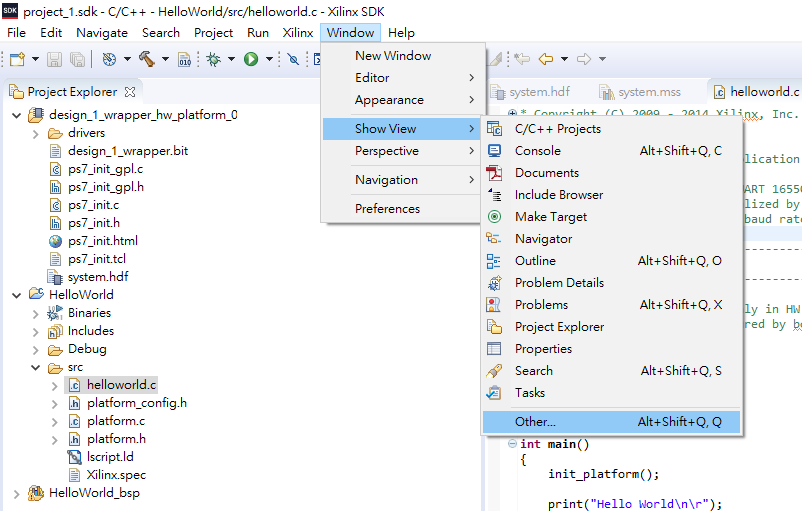

輸入**SDK Terminal**


設定 _Port_ 以及 _Baud Rate_

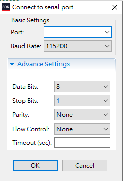

在 _Windows_ 環境中，需要從 _裝置管理員_ 查看 _USB Serial Port_ 為多少。
以圖片為例， _Port_ 需要設為 _COM4_ 。

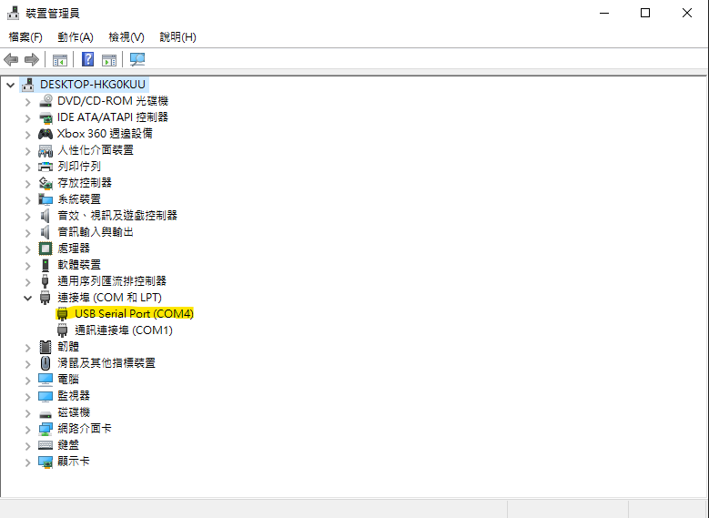

設定完之後，運行Hello World程式碼。
>Right Click Project
>
>Run as &rarr; Launch on Hardware (System Debugger)
>
>or
>
>Click Toolbar 


觀察**SDK Terminal**是否有印出Hello World。

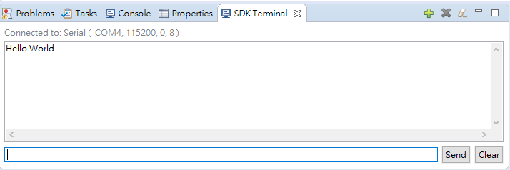


#### 4.2 Standalone Driver

更改main.c

```C
#include <stdio.h>

#define din0    0
#define din1    1
#define sum     2
#define product 3

int main()
{
	volatile int *baseaddr = (int *)0xA0000000;
	baseaddr[din0] = 2;
	baseaddr[din1] = 3;
	printf("Sum = %d, Product = %d\n", baseaddr[sum], baseaddr[product]);
    return 0;
}
```

首先 _**baseaddr**_ 為宣告 _int_ 的指標，指向實體記憶體位址，_**0x43c0_0000**_，實體記憶體位置可於下圖中獲得。

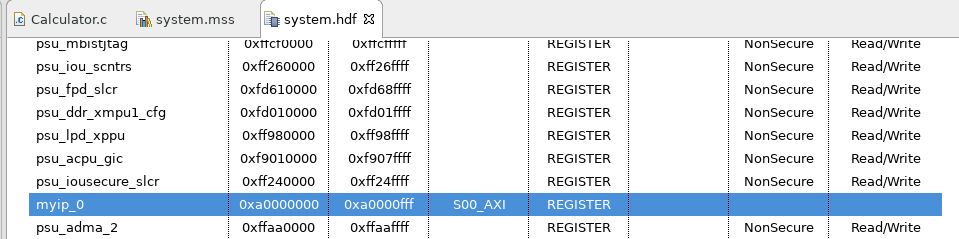

由於先前將AXI-Lite的Bitwidth設定為32bits，故此處將指標型態宣告為 _int_

其中 _**baseaddr[1]**_ 跟 _***(baseaddr+4)**_ 為相同意義，因為宣告 _**baseaddr[1]**_ 為 _int_ 的指標， _int_ 為32 _bit_ 也就是4 _byte_ ，每一個記憶體位址都能儲存1 _byte_ 的資料，所以根據 _C Compiler_ 會將 _int_ 的陣列[1]對應到起始記憶體位址加4。

運行之後的結果為下圖。

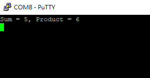

## 5. Petalinux

使用Petalinux前需先載入

```sh
source <PATH_to_PETALINUX>/settings.sh
```

#### 5.1 Create Project

**Note : 查看各指令的說明 :**
```
petalinux-XXX -h**
```

建立新專案
- ZCU102 : 
    ```
    petalinux-create -t project -n Calculator --template zynqMP
    ```
- Zedboard 或 ZC706 : 
    ```
    petalinux-create -t project -n Calculator --template zynq
    ```

專案建立後需進入專案目錄
```sh
cd <Path_to_Petalinux_Project> 
```

建立完成後需將Vivado的合成結果匯入
```
petalinux-config --get-hw-description=<存放HDF檔的路徑>

example：
/home/m063040083/Desktop/Vivado_Proj/Tutorial/soc_proj/soc_proj.sdk/design_1_wrapper_hw_platform_0
```

輸入完後會出現下列畫面，以下列出常修改的設定，**根據修求修改**，不修改可直接Exit

  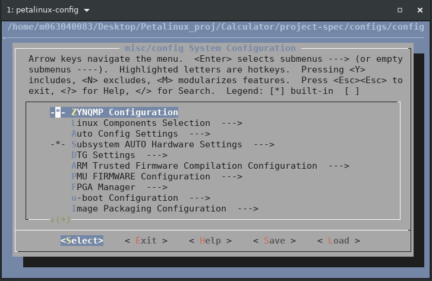

  - 固定IP設定
    Subsystem AUTO Hardware Settings &rarr; Ethernet Settings &rarr; 取消勾選Obtain IP address automatically &rarr; 設定固定IP的Address, Netmask, Gateway &rarr; Exit
    
    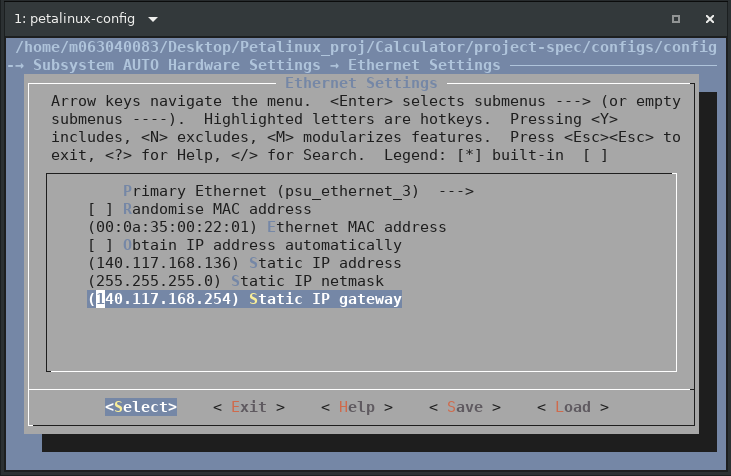

  - 選擇Linux File System的存放位置
    Image Packaging Configuration &rarr; Root filesystem type (XXX) &rarr; 以下二選一

    &rarr; 使用Petalinux內建的Yocto選INITRAMFS &rarr; Exit

    &rarr; 使用自己存放在Linux File System的LFS選SD card &rarr; Exit

    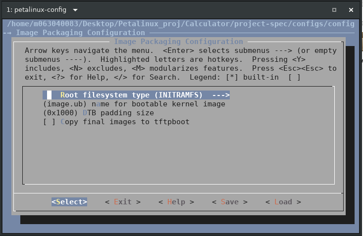

---

**(Option)** 若匯入成功並退出設定畫面後，要再回去設定畫面修改設定 :
```
petalinux-config
```

**(Option)** 若要設定Linux Kernel
```
petalinux-config -c kernel
```

**(Option)** 若要設定Petalinux內建的Yocto
```
petalinux-config -c root
```

---

設定完成後開始編譯並建置專案
```
petalinux-build
```

建置完成後需將Vivado產生的電路檔及Petalinux生成的相關檔案封裝成BOOT.bin
```
petalinux-package --boot --fsbl <FSBL_ELF> --fpga <BITSTREAM> --u-boot --pmufw <PMUFW_ELF>

example :
petalinux-package --boot --fsbl images/linux/zynqmp_fsbl.elf --fpga project-spec/hw-description/design_1_wrapper.bit --u-boot --pmufw images/linux/pmufw.elf
```

---

**(Option)** 使用QEMU作為虛擬機開啟Yocto (限使用Petalinux內建的Linux File System)

建立Pre-Built資料夾
```
petalinux-package --prebuilt
```

確認pre-built/linux/images/目錄內有pmu_rom_qemu_sha3.elf

若沒有可到官網下載BSP檔，解壓縮後放在pre-built/linux/images/目錄下 (pmu_rom_qemu_sha3.elf也是在壓縮檔內的相同路徑)

使用QEMU開機
```
petalinux-boot --qemu --kernel
```
開機後帳號密碼皆為root

---

最後，使用FPGA開機，將下列兩個檔案放到SD Card內

```
images/linux/BOOT.bin
images/linux/image.ub
```

將FPGA設定為SD Card開機模式，插入SD Card並上電

**!!!!缺圖片**

---

#### 5.2 Device Tree

**常用**的Device Tree檔案分別為以下兩個 :
- <Path_to_Petalinux_Project>/components/plnx_workspace/device-tree/device-tree/**pl.dtsi**
- <Path_to_Petalinux_Project>/project-spec/meta-user/recipes-bsp/device-tree/files/**system-user.dtsi**
  
pl.dtsi紀錄Vivado的Block Diagrame內，IP的相關資訊，**此檔案不可修改**

system-user.dtsi提供使用者修改並覆蓋其他Device Tree內的參數

下列為此份教學產生的pl.dtsi內容

```dts
1   / {
2 	    amba_pl: amba_pl@0 {
3		    #address-cells = <2>;
4		    #size-cells = <2>;
5		    compatible = "simple-bus";
6		    ranges ;
7		    myip_0: myip@a0000000 {
8			    clock-names = "s00_axi_aclk";
9			    clocks = <&clk 71>;
10			    compatible = "xlnx,myip-1.0";
11			    reg = <0x0 0xa0000000 0x0 0x1000>;
12			    xlnx,s00-axi-addr-width = <0x4>;
13			    xlnx,s00-axi-data-width = <0x20>;
14		    };
15		    psu_ctrl_ipi: PERIPHERAL@ff380000 {
16			    compatible = "xlnx,PERIPHERAL-1.0";
17			    reg = <0x0 0xff380000 0x0 0x80000>;
18		    };
19		    psu_message_buffers: PERIPHERAL@ff990000 {
20			    compatible = "xlnx,PERIPHERAL-1.0";
21			    reg = <0x0 0xff990000 0x0 0x10000>;
22		    };
23	    };
24  };
```

第7~14行是第3章封裝的IP，下列僅解釋常用的資訊

- myip_0: myip@a0000000 &rarr; myip_0為此IP的名字，a0000000為IP分配到的記憶體地址
- compatible = "xlnx,myip-1.0" &rarr; xlnx,myip-1.0用於Linux Driver尋找IP的關鍵字

#### 5.3 Linux Driver

首先建立Driver的範本(建議)

```sh
cd <Path_to_Petalinux_Project> 
petalinux-create -t modules -n <MODULE_NAME> --enable
```

建立完後到<Path_to_Petalinux_Project>/project-spec/meta-user/recipes-modules/<MODULE_NAME>/files/的目錄下會有一份C檔案，以下**僅解釋必要資訊**

---

1. 定義Driver的授權、作者、描述等
```C
/* Standard module information, edit as appropriate */
MODULE_LICENSE("GPL");
MODULE_AUTHOR
    ("Xilinx Inc.");
MODULE_DESCRIPTION
    ("test - loadable module template generated by petalinux-create -t modules");
```

2. 定義Driver的資料結構，包含所需的資訊、變數等，視需求增減內容
```C
struct test_local {
	int irq;
	unsigned long mem_start;
	unsigned long mem_end;
	void __iomem *base_addr;
};
```

3. 定義中斷觸發時要執行的任務，若硬體無中斷功能可刪除 (詳細用法另外介紹)
```C
static irqreturn_t test_irq(int irq, void *lp)
{
	printk("test interrupt\n");
	return IRQ_HANDLED;
}
```

4. 描述載入Driver時要執行的任務
   
  | 函式                                            |                                               用途                                               |
  | :---------------------------------------------- | :----------------------------------------------------------------------------------------------: |
  | platform_get_resource(..., IORESOURCE_MEM, ...) |                            讀取Device Tree內IP分配(定義)的記憶體大小                             |
  | kmalloc                                         | 根據platform_get_resource讀取得到的容量分配**實體連續的記憶體區段**給Driver的資料結構(第2點)使用 |
  | dev_set_drvdata                                 |                       將platform device的資訊寫入Driver結構內的Device結構                        |
  | request_mem_region，通知Linux                   |                              Kernel此段記憶體由Linux Driver佔據使用                              |
  | ioremap                                         |     將原先Device Tree內定義的IP實體記憶體區段映射到kmalloc獲得的Linux Kernel的虛擬記憶體區段     |
  | platform_get_resource(..., IORESOURCE_IRQ, ...) | 讀取IRQ的編號 |
  | request_irq | 註冊IRQ編號於Linux Kernel上，並連結至中斷處理函式(第3點) |
  | error1、2、3 | 當前述函式發生錯誤時會跳躍至各旗標執行釋放資源的任務 |
 
```C
static int test_probe(struct platform_device *pdev)
{
	struct resource *r_irq; /* Interrupt resources */
	struct resource *r_mem; /* IO mem resources */
	struct device *dev = &pdev->dev;
	struct test_local *lp = NULL;

	int rc = 0;
	dev_info(dev, "Device Tree Probing\n");
	/* Get iospace for the device */
	r_mem = platform_get_resource(pdev, IORESOURCE_MEM, 0);
	if (!r_mem) {
		dev_err(dev, "invalid address\n");
		return -ENODEV;
	}
	lp = (struct test_local *) kmalloc(sizeof(struct test_local), GFP_KERNEL);
	if (!lp) {
		dev_err(dev, "Cound not allocate test device\n");
		return -ENOMEM;
	}
	dev_set_drvdata(dev, lp);
	lp->mem_start = r_mem->start;
	lp->mem_end = r_mem->end;

	if (!request_mem_region(lp->mem_start,
				lp->mem_end - lp->mem_start + 1,
				DRIVER_NAME)) {
		dev_err(dev, "Couldn't lock memory region at %p\n",
			(void *)lp->mem_start);
		rc = -EBUSY;
		goto error1;
	}

	lp->base_addr = ioremap(lp->mem_start, lp->mem_end - lp->mem_start + 1);
	if (!lp->base_addr) {
		dev_err(dev, "test: Could not allocate iomem\n");
		rc = -EIO;
		goto error2;
	}

	/* Get IRQ for the device */
	r_irq = platform_get_resource(pdev, IORESOURCE_IRQ, 0);
	if (!r_irq) {
		dev_info(dev, "no IRQ found\n");
		dev_info(dev, "test at 0x%08x mapped to 0x%08x\n",
			(unsigned int __force)lp->mem_start,
			(unsigned int __force)lp->base_addr);
		return 0;
	}
	lp->irq = r_irq->start;
	rc = request_irq(lp->irq, &test_irq, 0, DRIVER_NAME, lp);
	if (rc) {
		dev_err(dev, "testmodule: Could not allocate interrupt %d.\n",
			lp->irq);
		goto error3;
	}

	dev_info(dev,"test at 0x%08x mapped to 0x%08x, irq=%d\n",
		(unsigned int __force)lp->mem_start,
		(unsigned int __force)lp->base_addr,
		lp->irq);
	return 0;
error3:
	free_irq(lp->irq, lp);
error2:
	release_mem_region(lp->mem_start, lp->mem_end - lp->mem_start + 1);
error1:
	kfree(lp);
	dev_set_drvdata(dev, NULL);
	return rc;
}
```

5. 當卸載Driver時，執行資源釋放的任務
```C
static int test_remove(struct platform_device *pdev)
{
	struct device *dev = &pdev->dev;
	struct test_local *lp = dev_get_drvdata(dev);
	free_irq(lp->irq, lp);
	iounmap(lp->base_addr);
	release_mem_region(lp->mem_start, lp->mem_end - lp->mem_start + 1);
	kfree(lp);
	dev_set_drvdata(dev, NULL);
	return 0;
}
```

6. 於Device Tree內搜尋與.compatible的字串相符的IP，此處的.compatible內需填入Device Tree內IP的compatible欄位的字串

```C
#ifdef CONFIG_OF
static struct of_device_id test_of_match[] = {
	{ .compatible = "vendor,test", },
	{ /* end of list */ },
};
MODULE_DEVICE_TABLE(of, test_of_match);
#else
# define test_of_match
#endif
```

7. 當Linux掛(卸)載Driver時，會根據module_init或module_exit內定義的函式執行相對的動作

```C
static int __init test_init(void)
{
	printk("<1>Hello module world.\n");
	printk("<1>Module parameters were (0x%08x) and \"%s\"\n", myint,
	       mystr);

	return platform_driver_register(&test_driver);
}


static void __exit test_exit(void)
{
	platform_driver_unregister(&test_driver);
	printk(KERN_ALERT "Goodbye module world.\n");
}

module_init(test_init);
module_exit(test_exit);
```

---

以上為使用platform device所需的基本程式碼，但若要操作Driver則通常會額外使用字元裝置(Char Device)的功能，以下敘述如何添加字元裝置

**TODO**

#### 5.4 Linux Application

**TODO**

---

## 6 Linux File System

#### 6.1 Petalinux設定

首先需要到petalinux projectk的目錄，輸入
```
petalinux-config
```


DTG Settings &rarr; Kernel Bootargs

確認**generate boot args automatically**是否沒有勾起來，並將下面的欄位輸入參數
```
earlycon clk_ignore_unused earlyprintk root=/dev/mmcblk0p2 rw rootwait cma=1024M
```

完成後(如下圖)存檔並離開
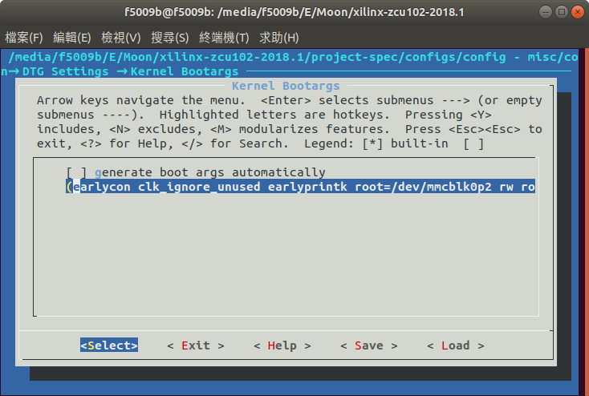

---------

#### 6.2 Ubuntu(For ARM-64bit)

從**Ubuntu**官方網站下載*ARM 64-bit*的映像檔
[Ubuntu_Offical_ARM_SERVER](https://ubuntu.com/download/server/arm)
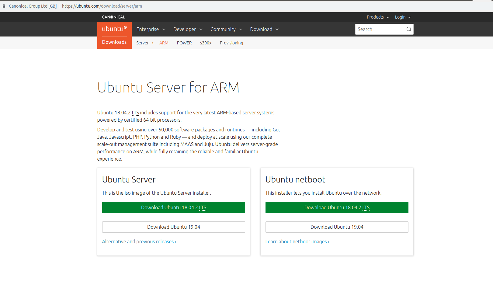

下載映像檔並將映像檔的內容解壓縮
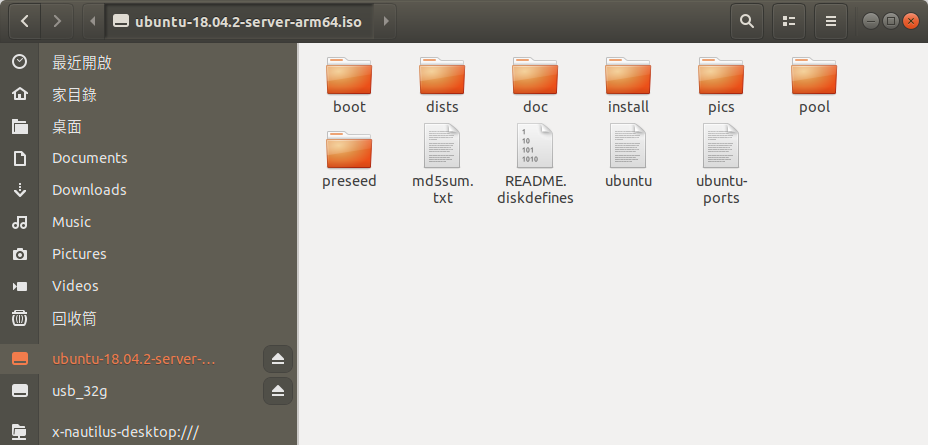

將**install**底下**filesystem.squashfs**裡面的檔案系統取出來
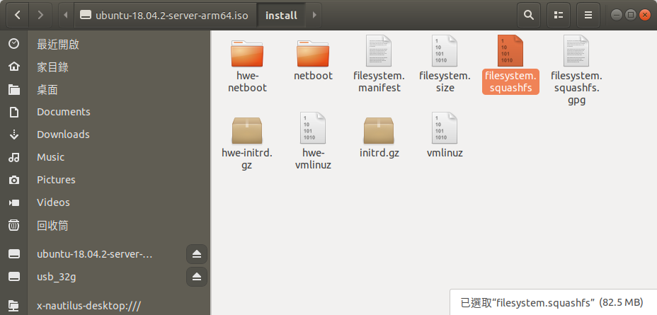

將**SDCard**分割成兩個磁區，分別是**Ext4**以及**FAT**
**FAT**用來存放**FPGA**的*BOOT.BIN*以及*image.ub*，Ext4用來存放檔案系統

提取檔案系統的指令
```sh
sudo unsquashfs -f -d /SDCARD/ext4_file_system/ filesystem.squashfs 
```

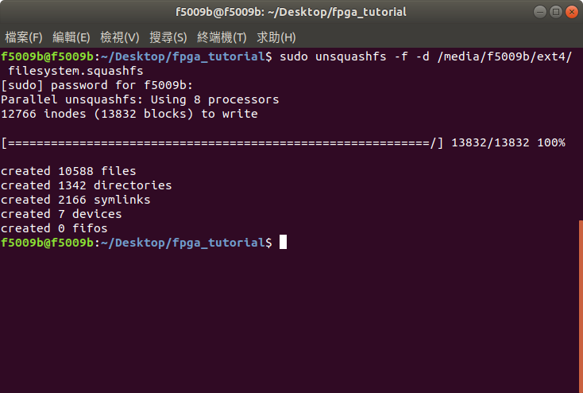

結果圖
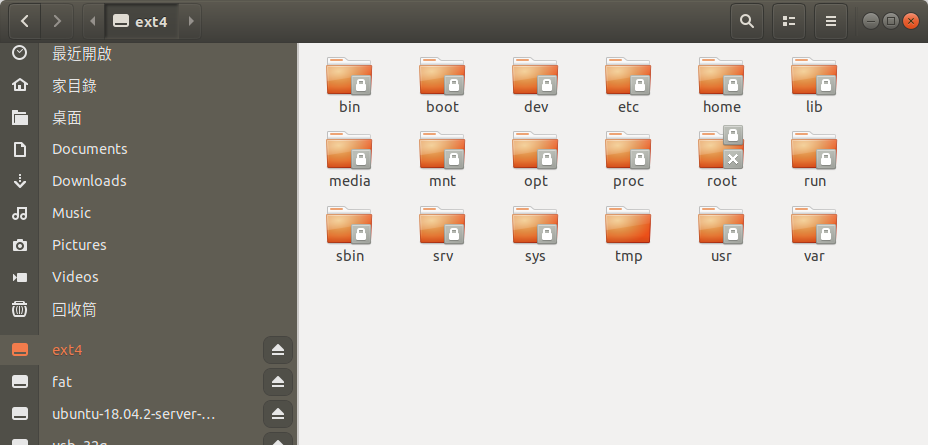

---------
#### 6.3 Arch Linux(For Zedboard)

從**Archlinux**官方下載**ARMv7 Zynq Zedboard**
[Archlinux_Offical_ARM](https://archlinuxarm.org/about/downloads)
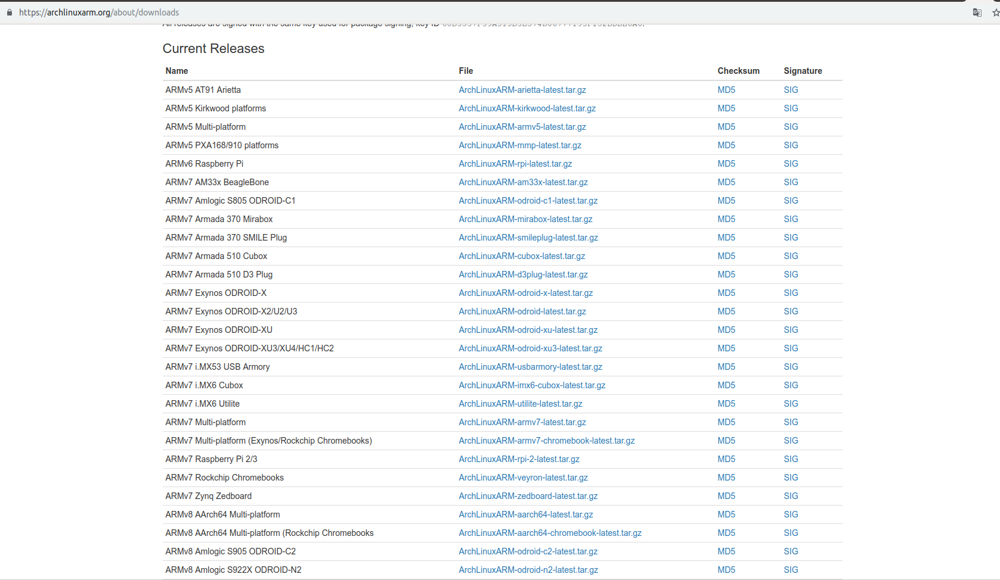

[Archlinux_Offical_ARM_Installation](https://archlinuxarm.org/platforms/armv7/xilinx/zedboard)

將**Archlinux Filesystem**放入使用分割好的**SDCard Ext4**中
```sh
bsdtar -xpf ArchLinuxARM-zedboard-latest.tar.gz -C /SDCARD/ext4_file_system/
sync (將尚未寫入硬碟的資料寫入至硬碟中)
```

完成圖

