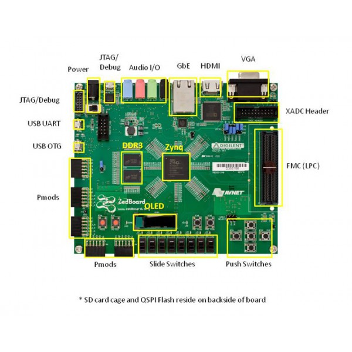
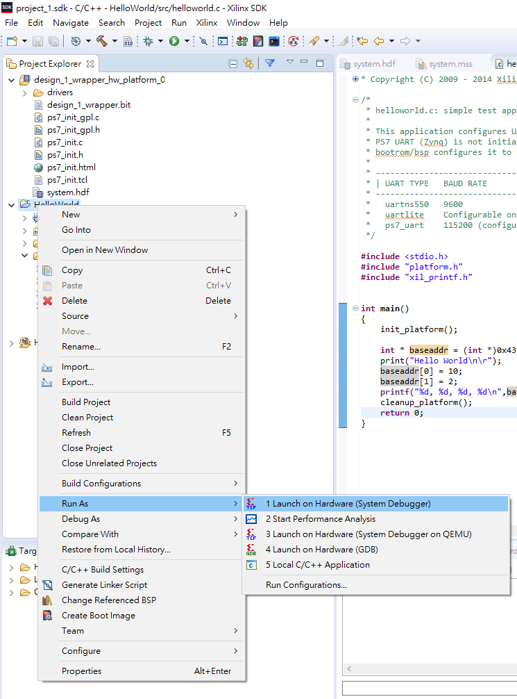

# Lab1

```
Author : 
    Jyun-Liang, Chen
    Pin-Lun, Lin
```
## 1. Outline
- [LAB1](#lab1)
  - [1. Outline](#1-outline)
  - [2. Vivado](#2-vivado)
      - [2.1 Requirement](#21-requirement)
      - [2.2 Create Vivado Project](#22-create-vivado-project)
      - [2.3 Vivado SDK](#23-vivado-sdk)
  - [3. Petalinux](#3-petalinux)
      - [3.1 Requirement](#31-requirement)
      - [3.2 Petalinux Command](#32-petalinux-command)
      - [3.3 Create Project](#33-create-project)
  - [4. ArchLinux](#4-archlinux)
      - [4.1 Requirement](#41-requirement)
      - [4.2 Prepare SD Card](#42-prepare-sd-card)
      - [4.3 Prepare Boot ArchLinux](#43-prepare-boot-archlinux)
      - [4.4 Print Hello World](#44-print-hello-world)
## 2. Vivado

### 2.1 Requirement

- Install vivado.
- Create a vivado project.
- Create block design.
- Import ZYNQ.
- Generate Bitstream.

In this tutorial, I use：

- Xilinx Vivado 2018.3
- Ubuntu 18.04
- Zedboard
  
### 2.2 Create Vivado Project
#### New a project
>>File &rarr; Project &rarr; New...


#### Click Next


#### Input Your Project Name and Location


#### Check Option


#### Choose ZedBoard Zynq


#### Click Finish


#### Click Create Block Design


#### Input Block Design before Click OK


#### Click  and Double Click ZYNQ7 Processing System


#### Click 


#### Connect *FCLK_CLK_0* to *M_AXI_GP0_ACLK*


#### 接著按Validate Design確認沒有Error或Critical Warning並盡量將Warning修正掉


#### Block Diagrame驗證完成後，需要建立由RTL編寫的Top Module

>右鍵Block Diagrame的.db檔 &rarr; Create HDL Wrapper... &rarr; Let Vivado manage wrapper and auto-update &rarr; OK


#### 最後按Generate Bitstream做Synthesis and Implementation


#### _合成完成後確認沒有Error，Critical Warning和Warning需檢查是否會影響電路功能_

#### 確認 **Generate Bitstream** 完成


### 2.3 Vivado SDK

#### 之後將 **Bitstream** 匯入至 **SDK**

> File &rarr; Export &rarr; Export Hardware...


#### 開啟**SDK**

> File &rarr; Launch SDK


#### SDK


#### 建立專案

> File &rarr; New &rarr; Application Project


#### 設定Project Name


#### 選擇空專案的模版


#### 將2條 _Micro-USB to USB_ 的線分別插入 _USB Uart_ 以及 _USB JTAG_



#### 將 **Bitstream** 檔燒入至 **Zedboard**

> Xilinx &rarr; Program FPGA

##### or

> Click Toolbar
> 


#### 之後會跳出一個視窗，確認*Bitstream*無誤之後就可以按下*Program*


#### 按下*Program*之後，會跳出一個視窗等到他跑完為止。


#### 燒入成功之後，*Zedboard*會亮藍燈。


#### 開啟*SDK Terminal*


##### 若找不到可以從這邊開啟

> Window &rarr; Show View  &rarr; Other...


#### 輸入*SDK Terminal*


#### Setting Port and Baud Rate


#### 在 _Windows_ 環境中，需要從 _裝置管理員_ 查看 _USB Serial Port_ 為多少。
##### 以圖片為例， _Port_ 需要設為 _COM4_ 。


#### 設定完之後，運行Hello World程式碼。
>Right Click Project
>
>Run as &rarr; Launch on Hardware (System Debugger)
>
>or
>
>Click Toolbar 




#### 觀察*SDK Terminal*是否有印出Hello World。


## 3. Petalinux

### 3.1 Requirement

- SSH to Server.
- Create a Petalinux project.
- HDF File(Vivado generate).

In this tutorial, I use：

- Xilinx Vivado 2018.3
- Xilinx Petalinux 2018.3
- Ubuntu 18.04

### 3.2 Petalinux Command

```sh
source <PATH_to_PETALINUX>/settings.sh
```
#### Note : 查看各指令的說明

``` sh
petalinux-XXX -h
```


### 3.3 Create Project

#### Create Petalinux Project

>> petalinux-create -t project -s avnet-digilent-zedboard-v2018.3-final
>> cd <Path_to_Petalinux_Project> 

#### Setting Petalinux Project
>> petalinux-config --get-hw-description=<存放HDF檔的路徑>

#### Setting Bootloader。
>> Image Packaging Configuration  &rarr; Root filesystem type 
>> Choose SD Card


>> DTG Settings &rarr; Kernel Bootargs


#### Check Option


#### Edit Argument

>> earlycon clk_ignore_unused earlyprintk root=/dev/mmcblk0p2 rw rootwait cma=512M


#### Save and Exit


#### Build
>> petalinux-build

#### Package
>> petalinux-package --boot --fpga images/linux/system.bit --fsbl images/linux/zynq_fsbl.elf --u-boot images/linux/u-boot.elf --force

#### Check File
##### BOOT.BIN & image.ub
>> ls image/linux/


## 4. ArchLinux

### 4.1 Requirement

- Ubuntu 18.04.
- Archlinux Arm-32bit.

### 4.2 Prepare SD Card

#### Check SD Card

##### 插入 SD Card 前
>> ls /dev/sd*


##### 插入 SD Card 後
>> ls /dev/sd*


##### Check Infomation
>> fdisk /dev/sdc


##### Get "/dev/sdc" Information
>> Input p


#### 清空 SD Card
>> Input d


#### 獨立切割100MB
>> Input n &rarr; Input 1 &rarr; Input 2048 &rarr; Input +100M &rarr; Y


#### 設定剩餘空間
>> Input n &rarr; Input 2 &rarr; Input Enter &rarr; Input Enter &rarr; Y


#### Change 100MB EXT4 to 100MB FAT32
##### Print Filesystem List
>> Input t &rarr; Input 1 &rarr; L


##### Choose FAT32 and Save
>> Input b &rarr; Input w


#### Setting SD Card Filesystem
>> sudo mkfs.fat /dev/sdc1
>> sudo mkfs.ext4 /dev/sdc2

### 4.3 Prepare Boot ArchLinux

#### Download ArchLinux
[Archlinux_Offical_ARM](https://archlinuxarm.org/about/downloads)

#### Copy ArchLinuxARM-zedboard to SD Card EXT4
>> mkdir ext4
>> sudo mount /dev/sdc2 ext4
>> sudo bsdtar -xpf /path/to/ArchLinuxARM-zedboard -C ext4
>> cd ext4
>> sync
>> sudo umount ext4


#### Copy BOOT.BIN and image.ub to SD Card FAT32
>> mkdir fat
>> sudo mount /dev/sdc1 fat
>> cp {path-to-petalinux_project}/images/linux/BOOT.BIN
>> cp {path-to-petalinux_project}/images/linux/image.ub
>> cd fat
>> sync
>> sudo umount fat

#### 將FPGA設定為SD Card開機模式，插入SD Card、Uart以及網路線並且開機。


### 4.4 Print Hello World

#### Use Putty
- [請參考SDK Terminal](#setting-port-and-baud-rate)

#### Setting Network (Static)
>> ip addr add 140.117.176.70/24 dev eth0
>> ip route add default via 140.117.176.254
#### Setting Network (Dynamic)
>> dhcp
#### Using Pacman
>> pacman-key --init
>> pacman-key --populate archlinuxarm
>> pacman -Syy
>> pacman -Su
>> pacman  -S vim base-devel
#### Test : Print Hello World(Using C++)
